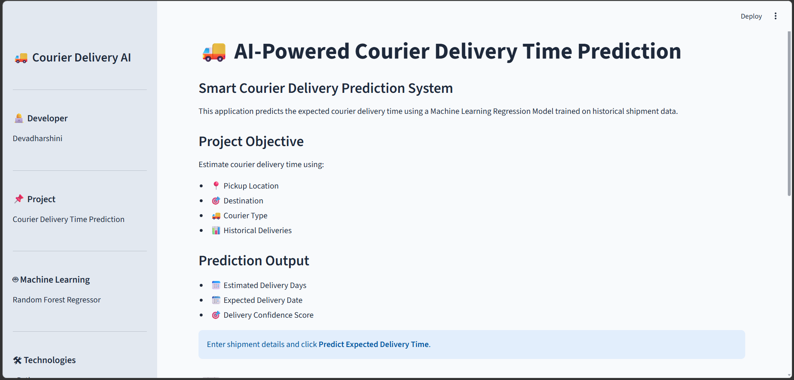
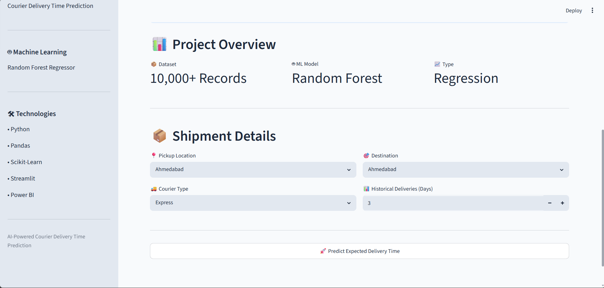
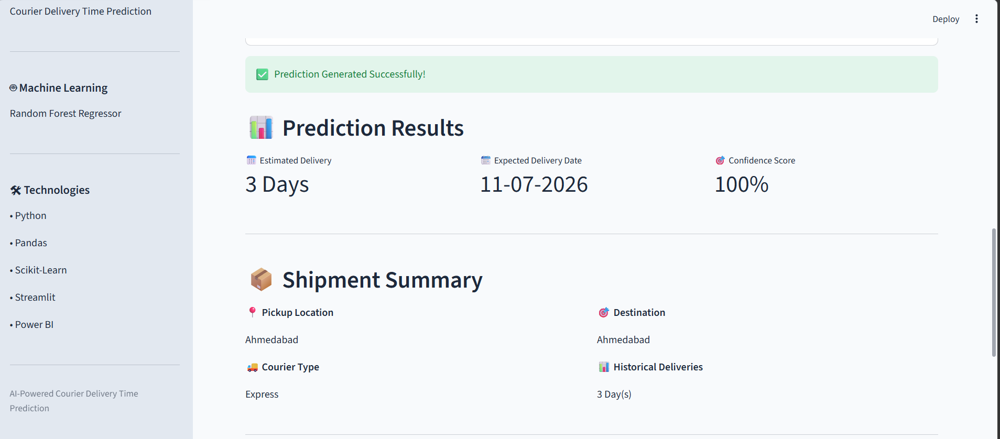
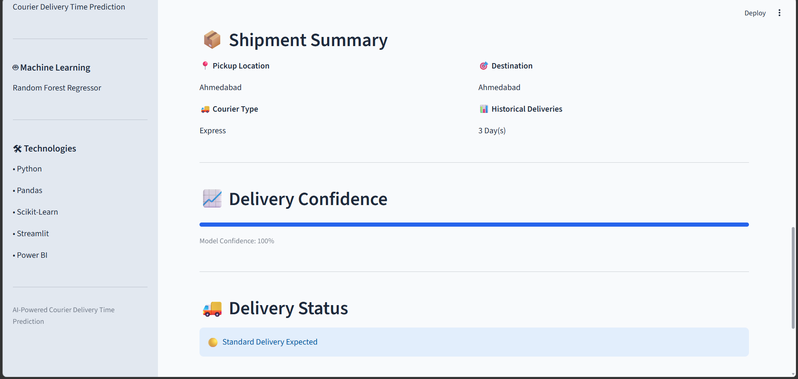
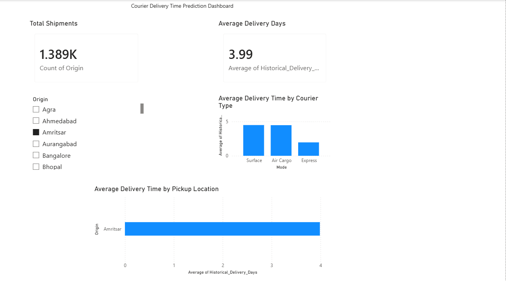
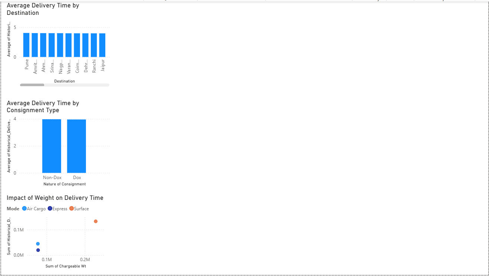
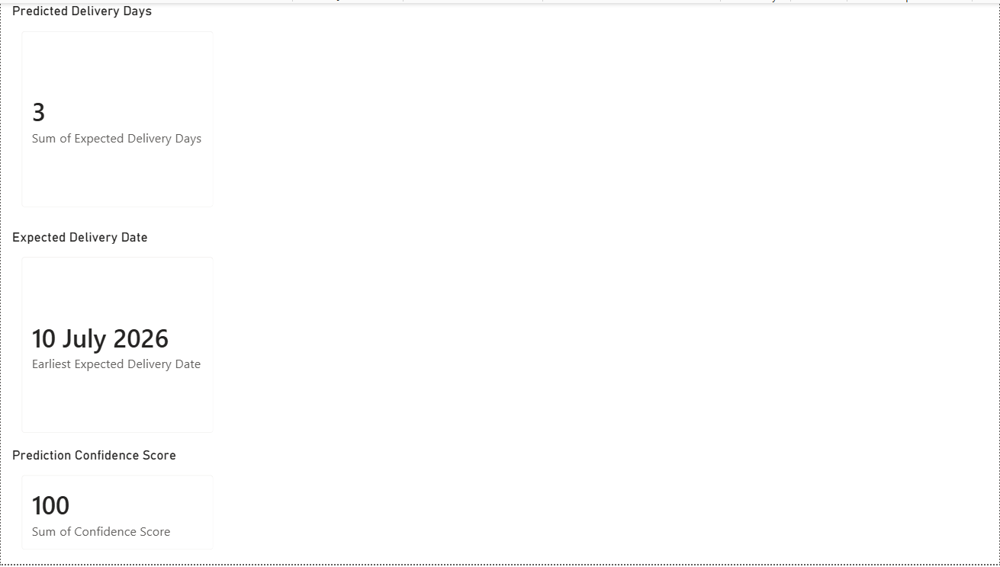

# 🚚 AI-Powered Courier Delivery Time Prediction

## 📌 Project Overview

This project predicts the expected delivery time of courier shipments using a Machine Learning model trained on historical delivery data.

The application provides users with an estimated delivery time, expected delivery date, and a delivery confidence score based on shipment details.

---

## 🌐 Live Demo

🚀 **Streamlit Web App**

https://courier-delivery-time-prediction-wxf2g9im9oyzf6ttz2jsbd.streamlit.app/

---

## 🎯 Project Objectives

- Predict courier delivery time accurately.
- Reduce manual estimation.
- Improve shipment planning.
- Demonstrate the use of Machine Learning in logistics.

---

## 🛠 Technologies Used

- Python
- Pandas
- NumPy
- Scikit-Learn
- Streamlit
- Power BI
- Joblib

---

## 📥 Input Parameters

- 📍 Pickup Location
- 🎯 Destination
- 🚚 Courier Type
- 📊 Historical Deliveries (Days)

---

## 📤 Output

- 📅 Estimated Delivery Time
- 📆 Expected Delivery Date
- 🎯 Delivery Confidence Score
- 🚚 Delivery Status

---

## 🤖 Machine Learning Model

**Algorithm Used**

Random Forest Regressor

### Why Random Forest?

Random Forest Regressor was selected because it:

- Handles nonlinear relationships effectively.
- Reduces overfitting through ensemble learning.
- Provides reliable predictions on structured datasets.
- Performs well for regression-based prediction problems.

---

## ⚙️ Prediction Method

The model predicts courier delivery time using the following inputs:

- Pickup Location
- Destination
- Courier Type
- Historical Delivery Days

The predicted delivery time is then used to calculate the expected delivery date.

---

## 🎯 Delivery Confidence Score

The Delivery Confidence Score displayed in the application is a custom reliability indicator.

It is calculated by comparing the predicted delivery time with the historical delivery time provided by the user.

**Note:**  
This score is a custom reliability metric designed to improve user understanding and should not be interpreted as the native confidence produced by the Random Forest model.

---

## 📊 Dashboard

The Power BI Dashboard includes:

- Delivery Overview
- Delivery Analysis
- Prediction Dashboard

---

## ▶️ How to Run

Clone the repository

```bash
git clone https://github.com/YOUR_USERNAME/YOUR_REPOSITORY.git
```

Install dependencies

```bash
pip install -r requirements.txt
```

Run the application

```bash
streamlit run app.py
```

---

## 📁 Project Structure

```
Courier_Delivery_Prediction/
│
├── app.py
├── requirements.txt
├── README.md
│
├── dataset/
├── models/
├── notebooks/
├── powerbi/
└── screenshots/
```

---

## 📸 Project Features

✅ Machine Learning-Based Delivery Prediction

✅ Expected Delivery Date Estimation

✅ Delivery Confidence Score

✅ Interactive Streamlit Web Application

✅ Power BI Dashboard

✅ User-Friendly Interface

---

## ⚠️ Limitations

The model predicts delivery time using the available dataset features only.

Factors such as:

- Weather
- Traffic
- Holidays
- Package Weight
- Road Conditions

are not included in the dataset and therefore are not considered during prediction.

---

## 🚀 Future Enhancements

- Live Shipment Tracking
- Weather-Based Prediction
- Traffic Analysis
- Interactive Maps
- Real-Time Courier API Integration

---

# 📷 Project Screenshots

## 🚚 Streamlit Web Application

### Home Page



---

### Home Page (Continued)



---

### Prediction Result



---

### Prediction Result (Continued)



---

## 📊 Power BI Dashboard

### Delivery Overview



---

### Delivery Analysis



---

### Prediction Dashboard



---

## 👩‍💻 Developer

**Devadharshini K**

Final Year B.Tech Information Technology Student

### Skills

- Python
- Machine Learning
- Data Analysis
- Streamlit
- Power BI
- SQL
- Pandas
- Scikit-Learn

---

## ⭐ If you found this project useful

Please consider giving this repository a ⭐ on GitHub.